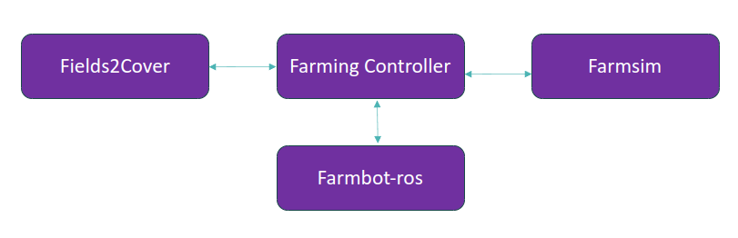

# Robs4Crops

Robs4Crops is a four-year project co-funded by the European Commission to accelerate the shift towards the large-scale implementation of robotics and automation across the European farming landscape.

# Setting up the project

To set up the project, you need to follow the steps below:

1. launch [Farmsim](https://github.com/robs4crops/farmsim)
2. launch [Farmbot](https://github.com/farmbot-ros)
3. launch the [Fields2cover API](https://github.com/Fields2Cover/Fields2Cover/pull/188)
4. launch the [FarmingController](https://github.com/robs4crops/farmingcontroller)
5. optionally launch the [Farmingcontroller front-end](https://github.com/robs4crops/farmingcontroller_frontend)

The architecture will be as follows:



# Papers

Fountas, S., Malounas, I., Athanasakos, L., Avgoustakis, I., & Espejo-Garcia, B. (2022). AI-Assisted Vision for Agricultural Robots. AgriEngineering, 4(3), 674-694.

Holm, S., Pedersen, S. M., & Tamirat, T. W. (2024). Robots in agriculture – A case-based discussion of ethical concerns on job loss, responsibility, and data control. Smart Agricultural Technology, 9, 100633. doi: https://doi.org/10.1016/j.atech.2024.100633

Karagiannis, P., Van Evert, F. K., & al, e. (2024). On an intelligent system to plan agricultural operations. Smart Agricultural Technology. doi: https://doi.org/10.1016/j.atech.2024.100707

Ørum, J. E., Tamirat, T. W., Pedersen, S. M., Stratton, A. D. H., Veldhuisen, B., & Hilbrands, H. (2023). Optimal use of agricultural robot in arable crop rotation: A case study from the Netherlands. Smart Agricultural Technology, 5, 100261. doi: https://doi.org/10.1016/j.atech.2023.100261

Papantonatou, M.-Z., Papadopoulos, G., Fountas, S., Uyar, H., & Van Evert, F. (2024). Shaping the agricultural future: Engaging stakeholder feedback for the development of agricultural robotic solutions. Available at https://doi.org/10.5281/zenodo.13919525. Paper presented at the AgEng2024.

Paraforos, D. S., Aubé, C., Athanasakos, L., Avgoustakis, I., Baron, S., Bresilla, T., et al. (2022). Connecting agricultural robots and smart implements by using ISO 11783 communication. IFAC-PapersOnLine. , 55(32), 200-205. doi: https://doi.org/10.1016/j.ifacol.2022.11.139

Rascón, J.F., Reverté, P., Ruiz, X., Sanches, M., Serrano, D., Rizzo, C (2024). Leveraging Behavior Trees for Hybrid Autonomous Navigation in Seasonal Agricultural Environments. Paper presented at the 7th Iberian Robotics Conference (ROBOT24).
Available at https://eventos.upm.es/getFiles/hash/OhZjZmNGMzQWMiJGOxYjZkNmNlVjZ1UmMgTOjdjNiND:NzVmaEhsQk8xTEZrWGh6VlE0WWo0cjh1c3VhekJ2QkNVZVQ1ZGgzZkkyNm9oOGE5Y1NKMW5yZm5iRzZRTVZRaEdLZTBmWVpRdG9YaWN1NlZZNmhhalRMbGdNNDlaVURsY1JpcHVIV1JYZXdHT0RSc2VpWFBnNDZPaElsSUcyRTRldXpQZFhLOTRhMFVzVHlKVWhkTDQ1eGYxTko2b2RXMzltYVgzZ0l1a1B5c3JMWllCdS9kTlNhY2ZJSThRK011a2R3ZUYrZnU3L090b3FZb0ZrZDNkUlFTK05ZME5vS3ZQZFd0cUZybkJQa0NDTE9tOTM0K1VzMk1kenlpQlJaYVQ3Z2VZdDFIYzR4dnBJcWZqUTZTZmc9PQ==

Sharipov, G., Bresilla, T., Nieuwenhuizen, A., Hemming, J., Van Evert, F. K., Aubé, C., et al. (2023). Communication between agricultural robot and mechanical weeding machine based on ISO 11783 network. Paper presented at the IFAC 2023. Available at https://doi.org/10.1016/j.ifacol.2023.10.093, Japan

Sharipov, G. M., Heiß, A., Bresilla, T., Nieuwenhuizen, A. T., Hemming, J., van Evert, F. K., et al. (2023). Smart implements by leveraging ISOBUS: Development and evaluation of field applications. Smart Agricultural Technology, 6, 100341. doi: https://doi.org/10.1016/j.atech.2023.100341

Tamirat, T., Pedersen, S., Ørum, J., de Jonge, E., & Kool, F. (2023). Drivers for robot use in field crop farming: farmers’ perspectives from four case areas in Europe Precision agriculture'23 (pp. 813-820): Wageningen Academic.

Tamirat, T. W., Pedersen, S. M., Ørum, J. E., & DeJonghe, L. (2023). Cost benefit analysis of robotic weeding in vineyards: A case study from France. Paper presented at the Proceedings of the 6th Symposium on Agri-Tech Economics for Sustainable Futures. Available at https://ageconsearch.umn.edu/record/344214/?v=pdf.

Tamirat, T. W., Pedersen, S. M., Ørum, J. E., & Holm, S. H. (2023). Multi-stakeholder perspectives on field crop robots: lessons from four case areas in Europe. Smart Agricultural Technology, 4, 100143. doi: https://doi.org/10.1016/j.atech.2022.100143

Van Evert, F. K., Avgoustakis, G., Baron, S., Bresilla, T., Dritsopoulos, T., Fountas, S., et al. (2024). Implementing a digital twin for flexible operation of agricultural robotics. In E. van Henten & Y. Edan (Eds.), Advances in Agri-Food Robotics Hb: Advances in Agri-Food Robotics: Burleigh Dodds Science Publishing Limited. Available online at https://dx.doi.org/10.19103/AS.2023.0124.28.

# Citation

If you use this work, please cite it as below.

```bibtex
@inbook{VanEvert2024,
    author = {F. K. Van Evert and G. Avgoustakis and S. Baron and T. Bresilla and T. Dritsopoulos and S. Fountas and et al.},
    title = {Implementing a digital twin for flexible operation of agricultural robotics},
    year = {2024},
    editor = {E. van Henten and Y. Edan},
    booktitle = {Advances in Agri-Food Robotics Hb: Advances in Agri-Food Robotics},
    publisher = {Burleigh Dodds Science Publishing Limited},
    url = {https://dx.doi.org/10.19103/AS.2023.0124.28}
}

```

# Acknowledgement

This project has received funding from the European Union’s Horizon 2020 research and innovation programme under grant agreement No. 101016807.


